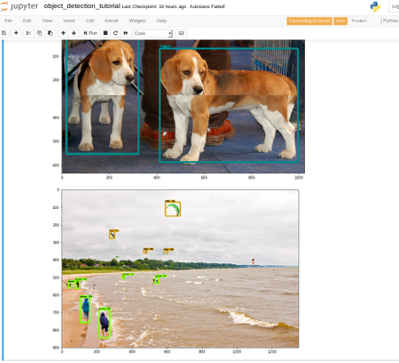

# Tensorflow object detection

## Start
First clone models:
```
git clone https://github.com/tensorflow/models.git
```
in this folder which is mounted into docker when running the tensorflow GPU container by:
```
make docker-jupyter
```
which starts up jupyter notebooks session in object-detection folder. Now you are ready to run
the demo example:
```
object_detection_tutorial.ipynb
```
When successfull you will get something like:



## Install NVIDIA docker
[How to install.](https://github.com/NVIDIA/nvidia-docker)
When successfull this command will run
```
docker run --runtime=nvidia --rm nvidia/cuda:9.0-base nvidia-smi
```
and get something like:
```
Thu Nov 15 10:20:49 2018       
+-----------------------------------------------------------------------------+
| NVIDIA-SMI 390.77                 Driver Version: 390.77                    |
|-------------------------------+----------------------+----------------------+
| GPU  Name        Persistence-M| Bus-Id        Disp.A | Volatile Uncorr. ECC |
| Fan  Temp  Perf  Pwr:Usage/Cap|         Memory-Usage | GPU-Util  Compute M. |
|===============================+======================+======================|
|   0  GeForce GTX 970     Off  | 00000000:03:00.0  On |                  N/A |
|  1%   46C    P8    12W / 200W |    380MiB /  4039MiB |      5%      Default |
+-------------------------------+----------------------+----------------------+
                                                                               
+-----------------------------------------------------------------------------+
| Processes:                                                       GPU Memory |
|  GPU       PID   Type   Process name                             Usage      |
|=============================================================================|
+-----------------------------------------------------------------------------+
```