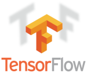
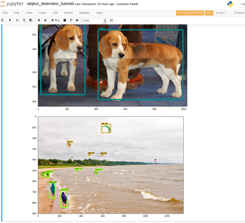
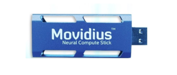
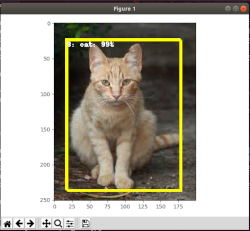

# Computer vision with AI

## Tensorflow object detection


### Run Tensorflow Object Detection API Demo
First clone models:
```
git clone https://github.com/tensorflow/models.git          [1]
```
in this folder which is mounted into docker when running the tensorflow GPU container by:
```
make docker-jupyter
```
which starts up jupyter notebooks session in object-detection folder. Now you are ready to run
the demo example:
```
object_detection_tutorial.ipynb
```
When successfull you will get something like:



### Install NVIDIA docker
Check this [link](https://github.com/NVIDIA/nvidia-docker) on how to install *NVIDIA Container Runtime for Docker*.
If you don't have docker check this tutorial to install it on [Ubuntu](https://docs.docker.com/install/linux/docker-ce/ubuntu/).
When successfull this command will run
```
docker run --runtime=nvidia --rm nvidia/cuda:9.0-base nvidia-smi
```
and give something like:
```
Thu Nov 15 10:20:49 2018       
+-----------------------------------------------------------------------------+
| NVIDIA-SMI 390.77                 Driver Version: 390.77                    |
|-------------------------------+----------------------+----------------------+
| GPU  Name        Persistence-M| Bus-Id        Disp.A | Volatile Uncorr. ECC |
| Fan  Temp  Perf  Pwr:Usage/Cap|         Memory-Usage | GPU-Util  Compute M. |
|===============================+======================+======================|
|   0  GeForce GTX 970     Off  | 00000000:03:00.0  On |                  N/A |
|  1%   46C    P8    12W / 200W |    380MiB /  4039MiB |      5%      Default |
+-------------------------------+----------------------+----------------------+
                                                                               
+-----------------------------------------------------------------------------+
| Processes:                                                       GPU Memory |
|  GPU       PID   Type   Process name                             Usage      |
|=============================================================================|
+-----------------------------------------------------------------------------+
```
This image explains it all:


### Specialized images
In order to do GPU accelerated calculations based on the NVIDIA cuDNN and tensorflow
use the image `heliconwave/object-detection`. You can build it via:
```
make docker-image
```
To enter bash type:
```
make docker-bash
```
If you are running object-detection API from `[1]` you need run this command before outside the docker container:
```
protoc object_detection/protos/*.proto --python_out=.
```
To be able to run X-server applications like opencv uses you need to type on your host OS:
```
xhost +local:docker
```
where docker is the user for your docker deamon, which should not be root following best practise. 

## Movidius

Note only Movidius Neural Stick ver 1 works with NCSDK. To use the Neural Compute Stick ver2 OpenVINO is required and will not work with NCSDK. Docker images described below is for NVSDK ver 1.0 API.

### Docker
Build image:
```
make docker-image-ncsdk
```
Run image with priviliged rights:
```
make docker-bash-ncsdk
```

### Example

For all examples you need to download the App Zoo and start a docker container:
```
git clone https://github.com/movidius/ncappzoo.git
make docker-bash-ncsdk
```

To run image classifier:
```
cd ncappzoo/apps/object-detector
sudo python3 object-detector.py --image ../../data/images/pic_075.jpg 
```
To run live object-detection:
```
cd ncappzoo/apps/live-object-detector
sudo make run
```