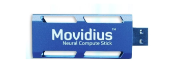

# Movidius (NCS ver 1)


Note only Movidius Neural Stick ver 1 works with NCSDK. To use the Neural Compute Stick ver2 OpenVINO is required and will not work with NCSDK. Docker images described below is for NVSDK ver 1.0 API.

## Docker
Build image:
```Bash
make docker-image-ncsdk
```
Run image with priviliged rights:
```Bash
make docker-bash-ncsdk
```
or using compose:
```Bash
LOCAL_USER_ID=$(id -u ${USER}) DISPLAY=${DISPLAY} docker-compose run ncsdk bash
```

## Example
For all examples you need to download the App Zoo and start a docker container:
```Bash
git clone https://github.com/movidius/ncappzoo.git
make docker-bash-ncsdk
```


To run image classifier:
```Bash
cd ncappzoo/apps/object-detector
sudo python3 object-detector.py --image ../../data/images/pic_075.jpg 
```
If you run into an error message that you are missing the graph it means you have not downloaded the model by first building the example:
```Bash
cd ncappzoo/caffe/SSD_MobileNet
make
```
To run live object-detection:
```Bash
cd ncappzoo/apps/live-object-detector
sudo make run
```

Verified working examples:
* security-cam
* video_face_matcher
* MultiStick_TF_Inception
* image-classifier
* rapid-image-classifier

Verified does NOT work
* gender_age_lbp
* live-image-classifier